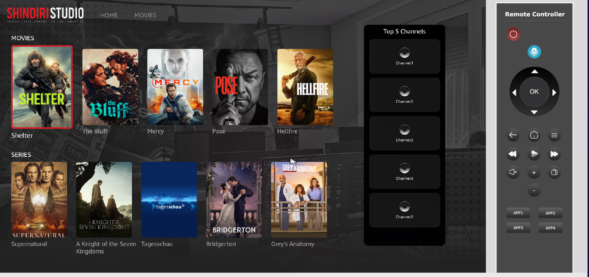
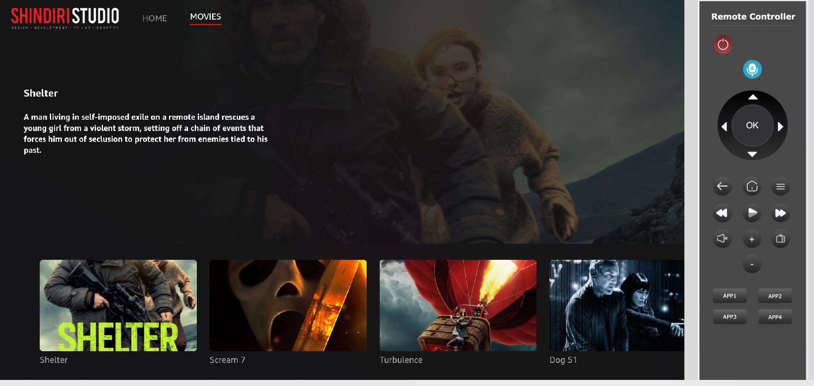
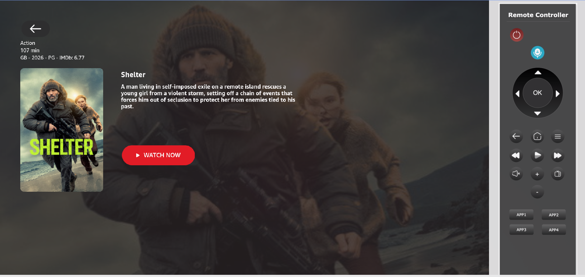
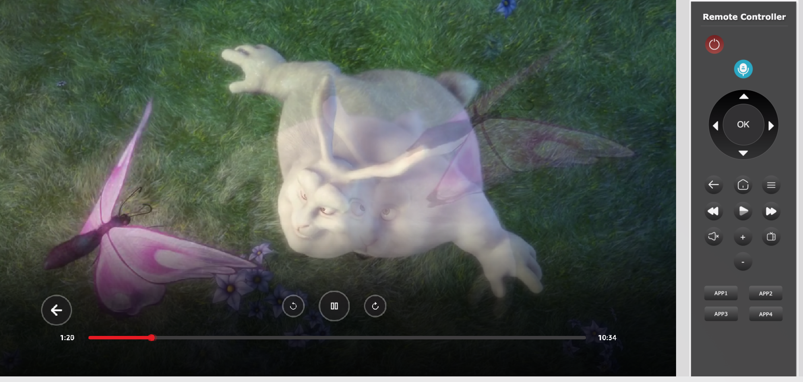

# ShindiriTV

<div align="center">


**A streaming TV application built for Amazon VegaOS (Fire TV)**

[Features](#features) • [Tech Stack](#tech-stack) • [Getting Started](#getting-started) • [Architecture](#architecture)

</div>

---

## Screenshots

<div align="center">

|                 Home                 |                  Movies                  |
| :----------------------------------: | :--------------------------------------: |
|  |  |

|                  Details                   |                  Player                  |
| :----------------------------------------: | :--------------------------------------: |
|  |  |

</div>

---

## About VegaOS

**VegaOS** is Amazon's next-generation operating system designed for Fire TV devices. It introduces a modern development experience through the **Kepler SDK**, which is built on a custom fork of React Native optimized for TV interfaces.

Key characteristics of VegaOS development:

- **React Native (Amazon Fork)** - Leverages familiar React Native patterns adapted for TV
- **10-foot UI Experience** - Designed for living room viewing distances
- **D-pad/Remote Navigation** - Native support for TV remote control input
- **W3C Media APIs** - Standardized video playback interfaces
- **High Performance** - Optimized for streaming media applications

This application serves as an example of what can be built on the VegaOS platform, showcasing streaming capabilities, adaptive video playback, and TV-optimized user interfaces.

---

## About This App

**ShindiriTV** is a demo streaming application that demonstrates the capabilities of Amazon's VegaOS platform. The app fetches real movie and TV show data from The Movie Database (TMDB) API and provides a complete streaming experience with:

- Browsable content catalogs with carousels
- Detailed movie and series information pages
- Full video playback with adaptive streaming
- TV-optimized navigation and focus management

---

## Features

- **Browse Content** - Explore Now Playing Movies and Popular TV Shows
- **Movie Details** - View comprehensive information with hero banners, ratings, and metadata
- **Series Details** - Browse TV shows with season and episode information
- **Video Playback** - Full HLS/DASH adaptive streaming via Shaka Player
- **TV Navigation** - Optimized D-pad focus management for remote controls
- **Carousel Components** - Smooth horizontal scrolling content rails
- **DRM Ready** - Widevine and PlayReady DRM configuration support
- **Captions** - Subtitle and closed caption support
- **Adaptive Bitrate** - Automatic quality adjustment based on network conditions

---

## Tech Stack

| Category             | Technology                             |
| -------------------- | -------------------------------------- |
| **Platform**         | Amazon VegaOS (Kepler SDK)             |
| **Framework**        | React Native 0.72 (Amazon Fork)        |
| **Language**         | TypeScript 4.8                         |
| **State Management** | Redux Toolkit + React Redux            |
| **Video Player**     | Shaka Player 4.8.5                     |
| **Navigation**       | React Navigation 7.x (Stack Navigator) |
| **HTTP Client**      | Axios                                  |
| **Data Source**      | TMDB (The Movie Database) API          |
| **UI Components**    | Kepler UI Components                   |
| **Testing**          | Jest + React Testing Library           |

---

## Architecture

```
┌─────────────────────────────────────────────────────────────┐
│                         SCREENS                              │
│      HomeScreen  │  MovieScreen  │  DetailScreen  │  Player │
├─────────────────────────────────────────────────────────────┤
│                        COMPONENTS                            │
│   MovieCard  │  MovieCarousel  │  FocusableElement  │  etc  │
├─────────────────────────────────────────────────────────────┤
│                    STATE MANAGEMENT                          │
│                 Redux Toolkit (moviesSlice)                  │
│        fetchNowPlaying  │  fetchDetails  │  fetchTVShows    │
├─────────────────────────────────────────────────────────────┤
│                     SERVICES / API                           │
│              tmdbService  │  Axios API Client                │
├─────────────────────────────────────────────────────────────┤
│                      MEDIA PLAYER                            │
│         Shaka Player  +  VegaOS W3C Media Polyfills          │
│    (HLS/DASH Parsing, ABR, DRM, Captions)                   │
├─────────────────────────────────────────────────────────────┤
│                  VEGAOS / KEPLER RUNTIME                     │
│      KeplerVideoSurfaceView  │  KeplerCaptionsView          │
│              VideoPlayer  │  Focus Management                │
└─────────────────────────────────────────────────────────────┘
```

---

## Getting Started

### Prerequisites

- **Node.js** 18+
- **VegaOS SDK** (Kepler CLI) - [Installation Guide](https://developer.amazon.com/docs/vega/0.22/install-vega-sdk.html)
- **Fire TV Device** or VegaOS Virtual Device
- **TMDB API Key** - Free at [themoviedb.org](https://www.themoviedb.org/settings/api)

### Installation

```bash
# Clone the repository
git clone <repository-url>
cd shindiriTV

# Install dependencies
npm install
```

### Environment Setup

Create a `.env` file in the project root with your TMDB credentials:

```env
EXPO_PUBLIC_URL_API=https://image.tmdb.org/t/p/w500
EXPO_PUBLIC_API_KEY=your_tmdb_api_key_here
EXPO_PUBLIC_API_URL=https://api.themoviedb.org/3
EXPO_PUBLIC_SERVER_URL=your_server_url
```

> **Note:** You can obtain a free API key by creating an account at [TMDB](https://www.themoviedb.org/) and requesting an API key in your account settings.

### Build & Run

#### Build the Application

```bash
# Build release version
npm run build:release

# Build debug version
npm run build:debug
```

#### Start the Virtual Device

```bash
# Start the VegaOS Virtual Device (emulator)
vega virtual-device start

# Optional: Extend timeout if boot takes longer
vega virtual-device start --timeout 120

# Optional: Custom resolution
vega virtual-device start --display-res=1920,1080
```

#### Run the Application

```bash
# For ARM architecture (Mac M-series)
vega run-app build/aarch64-release/vegatvapp_aarch64.vpkg com.shindiri.main -d VirtualDevice

# For x86_64 architecture
vega run-app build/x86_64-release/vegatvapp_x86_64.vpkg com.shindiri.main -d VirtualDevice
```

#### Subsequent Launches

After initial installation, use this command for faster launches (preserves app data):

```bash
vega device launch-app com.shindiri.main -d VirtualDevice
```

#### Stop the Virtual Device

```bash
vega virtual-device stop
```

---

## Keyboard Shortcuts

When using the VegaOS Virtual Device, use these keyboard shortcuts to simulate Fire TV remote input:

| Fire TV Remote           | Keyboard Key |
| ------------------------ | ------------ |
| Select                   | `ENTER`      |
| Up / Down / Left / Right | `Arrow Keys` |
| Back                     | `ESC`        |
| Home                     | `F1`         |
| Menu                     | `F2`         |
| Rewind                   | `F3`         |
| Play/Pause               | `F4`         |
| Fast Forward             | `F5`         |

---

## Project Structure

```
src/
├── api/                    # Axios API client configuration
├── components/             # Reusable UI components
│   ├── button/             # Button components (PlayerButton, ButtonIcon)
│   ├── FocusableElement    # TV-optimized focusable wrapper
│   ├── MovieCard           # Movie/TV show card component
│   ├── MovieCarousel       # Horizontal scrolling carousel
│   ├── Player              # Video player component
│   ├── PlayerControls      # Playback control buttons
│   └── Seekbar             # Video progress/seek bar
├── constants/              # App constants and configuration
├── contexts/               # React contexts
├── hooks/                  # Custom React hooks
├── mediaPlayer/            # Video playback implementation
│   ├── shakaplayer/        # Shaka Player wrapper
│   └── polyfills/          # Browser API polyfills for VegaOS
├── navigation/             # React Navigation setup
├── screens/                # Application screens
│   ├── HomeScreen          # Main landing page
│   ├── MovieScreen         # Movie browsing
│   ├── DetailPage/         # Movie/Series details
│   └── PlayerScreen        # Video playback
├── service/                # API service layer (TMDB)
├── store/                  # Redux store configuration
│   ├── movie/              # Movies slice (actions, reducers)
│   └── hooks/              # Typed Redux hooks
├── styles/                 # Shared styles and colors
├── types/                  # TypeScript type definitions
└── utils/                  # Utility functions
    ├── FocusManager        # TV focus restoration manager
    ├── Parser              # TMDB response parser
    └── pixelUtils          # Dimension utilities
```

---

## Available Scripts

| Command                 | Description              |
| ----------------------- | ------------------------ |
| `npm start`             | Start Metro bundler      |
| `npm run build:release` | Build release version    |
| `npm run build:debug`   | Build debug version      |
| `npm run lint`          | Run ESLint               |
| `npm run lint:fix`      | Run ESLint with auto-fix |
| `npm test`              | Run Jest tests           |
| `npm run test:snapshot` | Update Jest snapshots    |

---

## Resources

- [VegaOS Developer Documentation](https://developer.amazon.com/docs/vega/vega.html)
- [TMDB API Documentation](https://developer.themoviedb.org/docs)
- [Shaka Player Documentation](https://shaka-player-demo.appspot.com/docs/api/tutorial-welcome.html)
- [React Navigation Documentation](https://reactnavigation.org/docs/getting-started)

---

## License

This project is for demonstration purposes.

---

<div align="center">

**Built with Amazon VegaOS SDK**

</div>
